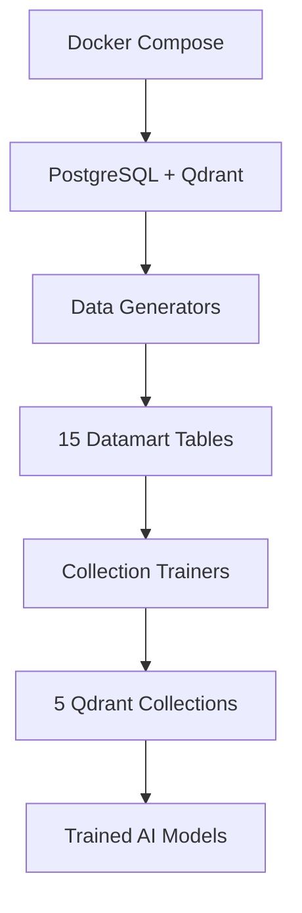
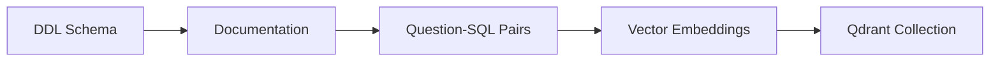

# 🎓 Academic Collections Training System

Complete separated training system for 5 Qdrant collections with Indonesian academic datamart data and Vanna AI.

## 📁 Project Structure

```
academic-training/
├── docker-compose-training.yml    # Docker orchestration
├── Dockerfile.trainer            # Training container
├── init-datamarts.sql           # PostgreSQL schema (15 tables)
├── requirements-trainer.txt      # Python dependencies
├── .env                         # Environment variables
├── logs/                        # Training logs
├──
├── 🎯 MAIN ORCHESTRATORS
├── train_main.py                # Main training orchestrator
├── data_generator.py            # Main data generator
├── vanna_setup.py               # Vanna AI configuration
├──
├── 👨‍🎓 COLLECTION TRAINERS
├── trainers/
│   ├── __init__.py              # Trainers package
│   ├── mahasiswa_trainer.py     # Student collection trainer
│   ├── dosen_trainer.py         # Lecturer collection trainer
│   ├── akademik_trainer.py      # Academic collection trainer
│   ├── keuangan_trainer.py      # Financial collection trainer
│   └── institusi_trainer.py     # Institutional collection trainer
├──
└── 📊 DATA GENERATORS
    └── generators/
        ├── __init__.py           # Generators package
        ├── mahasiswa_generator.py # Student data (3 tables)
        ├── dosen_generator.py     # Lecturer data (3 tables)
        ├── akademik_generator.py  # Academic data (3 tables)
        ├── keuangan_generator.py  # Financial data (3 tables)
        └── institusi_generator.py # Institutional data (3 tables)
```

## 🎯 System Overview

### **5 Specialized Qdrant Collections**

| Collection | Focus | Tables | Training Style |
|------------|-------|--------|----------------|
| 🎓 **mahasiswa_collection** | Student queries | 3 tables | DDL → Docs → Q&A |
| 👨‍🏫 **dosen_collection** | Lecturer queries | 3 tables | DDL → Docs → Q&A |
| 📚 **akademik_collection** | Academic queries | 3 tables | DDL → Docs → Q&A |
| 💰 **keuangan_collection** | Financial queries | 3 tables | DDL → Docs → Q&A |
| 🏛️ **institusi_collection** | Institutional queries | 3 tables | DDL → Docs → Q&A |

### **15 Datamart Tables (No Joins Required)**

Each collection contains 3 denormalized tables for fast querying:

#### 📚 Collection 1: MAHASISWA (Student Data)
- `student_performance` - Academic performance with GPA, credits, status
- `student_attendance` - Course attendance with percentages
- `student_finance` - Tuition payments and outstanding balances

#### 👨‍🏫 Collection 2: DOSEN (Lecturer Data)  
- `lecturer_profile` - Profile with position, workload, qualifications
- `lecturer_teaching` - Teaching performance with course metrics
- `lecturer_activity` - Research, publications, and funding data

#### 📖 Collection 3: AKADEMIK (Academic Data)
- `course_performance` - Course metrics with enrollment and grades
- `grade_distribution` - Grade analysis (A, B, C distributions)
- `academic_trends` - Performance trends over time

#### 💰 Collection 4: KEUANGAN (Financial Data)
- `revenue_summary` - Revenue by faculty and program
- `payment_analysis` - Payment methods and timing
- `financial_kpi` - Financial KPIs and metrics

#### 🏛️ Collection 5: INSTITUSI (Institutional Data)
- `faculty_statistics` - Faculty-level statistics and rankings
- `university_performance` - University-wide KPIs
- `accreditation_status` - Accreditation tracking and progress

## 🚀 Quick Start

### Prerequisites
- Docker & Docker Compose
- Google Gemini API Key

### 1. Setup Environment
```bash
# Copy template and customize
cp .env.template .env

# Edit .env and set your Gemini API key
# Get your API key from: https://makersuite.google.com/app/apikey
nano .env  # or use your preferred editor
```

**Required**: Update `GEMINI_API_KEY` in `.env` with your actual Google Gemini API key.

### 2. Run Complete Training
```bash
# Start everything: PostgreSQL + Qdrant + Training
docker-compose -f docker-compose-training.yml up

# Or step by step:
# 1. Start infrastructure
docker-compose -f docker-compose-training.yml up postgres qdrant -d

# 2. Run training
docker-compose -f docker-compose-training.yml up data-trainer
```

### 3. Alternative: Separate Data Population and Training

If you want to run data population and training separately (useful for development):

```bash
# 1. Start infrastructure only
docker-compose -f docker-compose-training.yml up postgres qdrant -d

# 2. Populate data only (without training)
docker-compose -f docker-compose-training.yml run --rm data-trainer python data_generator.py

# 3. Run training only (data already exists)
docker-compose -f docker-compose-training.yml run --rm data-trainer python train_main.py
```

**Note**: The main `data-trainer` service automatically does both data generation AND training in sequence. Use the separate commands above only for development/debugging purposes.

### 4. Check Results
```bash
# Check PostgreSQL data
docker exec -it academic_postgres psql -U postgres -d academic_datamart \
  -c "SELECT schemaname, tablename FROM pg_tables WHERE schemaname = 'datamart';"

# Check Qdrant collections
curl http://localhost:6333/collections

# View collection details
curl http://localhost:6333/collections/mahasiswa_collection
```

## 📊 Generated Data Summary

After successful training, you'll have:

| Collection | Records | Description |
|------------|---------|-------------|
| **student_performance** | 500 | Students with GPA, faculty, program |
| **student_attendance** | 800 | Attendance records with course details |
| **student_finance** | 400 | Payment status and outstanding balances |
| **lecturer_profile** | 150 | Lecturer profiles with positions |
| **lecturer_teaching** | 300 | Teaching performance records |
| **lecturer_activity** | 150 | Research and publication data |
| **course_performance** | 200 | Course metrics and enrollment |
| **grade_distribution** | 150 | Grade distributions by course |
| **academic_trends** | 400+ | Academic trends across periods |
| **revenue_summary** | 50 | Revenue data by faculty/program |
| **payment_analysis** | 50 | Payment method analysis |
| **financial_kpi** | 20 | Financial performance indicators |
| **faculty_statistics** | 5 | Faculty-level statistics (updated) |
| **university_performance** | 2 | University KPIs by period |
| **accreditation_status** | 30+ | Accreditation tracking data |
| **TOTAL** | **3000+** | **Complete academic dataset** |

## 🎯 Training Methodology

### Each Collection Follows 3-Step Training:

1. **🏗️ DDL Training** - Database schema with Indonesian comments
2. **📖 Documentation Training** - Indonesian terms and business rules  
3. **🤖 Question-SQL Training** - Natural language to SQL pairs

### Example Training Flow:
```python
# Step 1: DDL
trainer.add_schema_info("student_schema", """
CREATE TABLE datamart.student_performance (
    nim VARCHAR(20) NOT NULL,
    nama_mahasiswa VARCHAR(100) NOT NULL,
    ipk DECIMAL(3,2),
    -- Contains student academic performance data
);
""")

# Step 2: Documentation  
trainer.add_schema_info("student_docs", """
Indonesian Student Terms:
- Mahasiswa = Student
- NIM = Student ID Number
- IPK = GPA (Indeks Prestasi Kumulatif)
""")

# Step 3: Question-SQL Pairs
trainer.add_question_sql(
    "Berapa jumlah mahasiswa aktif?",
    "SELECT COUNT(*) FROM datamart.student_performance WHERE status_mahasiswa = 'Aktif';"
)
```

## 💬 Sample Queries by Collection

### 🎓 Mahasiswa Collection
```sql
-- Berapa jumlah mahasiswa aktif?
SELECT COUNT(*) FROM datamart.student_performance WHERE status_mahasiswa = 'Aktif';

-- Mahasiswa dengan IPK tertinggi per fakultas
SELECT fakultas, nim, nama_mahasiswa, ipk 
FROM datamart.student_performance 
WHERE status_mahasiswa = 'Aktif' 
ORDER BY fakultas, ipk DESC;

-- Status pembayaran per fakultas
SELECT fakultas, status_pembayaran, COUNT(*) 
FROM datamart.student_finance 
GROUP BY fakultas, status_pembayaran;
```

### 👨‍🏫 Dosen Collection
```sql
-- Dosen dengan publikasi terbanyak
SELECT nama_dosen, fakultas, jumlah_publikasi 
FROM datamart.lecturer_activity 
ORDER BY jumlah_publikasi DESC LIMIT 10;

-- Beban mengajar per fakultas
SELECT fakultas, AVG(beban_sks) as rata_beban_sks 
FROM datamart.lecturer_profile 
WHERE status_aktif = true 
GROUP BY fakultas;
```

### 📚 Akademik Collection
```sql
-- Mata kuliah dengan nilai tertinggi
SELECT nama_matkul, fakultas, rata_rata_nilai 
FROM datamart.course_performance 
ORDER BY rata_rata_nilai DESC LIMIT 10;

-- Distribusi nilai per program studi
SELECT program_studi, jumlah_a, jumlah_b, jumlah_c 
FROM datamart.grade_distribution 
WHERE program_studi = 'Teknik Informatika';
```

### 💰 Keuangan Collection
```sql
-- Pendapatan per fakultas
SELECT fakultas, SUM(total_terbayar) as total_pendapatan 
FROM datamart.revenue_summary 
GROUP BY fakultas;

-- Metode pembayaran paling populer
SELECT metode_pembayaran, SUM(jumlah_transaksi) 
FROM datamart.payment_analysis 
GROUP BY metode_pembayaran;
```

### 🏛️ Institusi Collection
```sql
-- Statistik per fakultas
SELECT fakultas, jumlah_dosen, jumlah_mahasiswa_aktif, rata_rata_ipk_fakultas 
FROM datamart.faculty_statistics;

-- Status akreditasi program studi
SELECT unit_name, fakultas, akreditasi_current, masa_berlaku 
FROM datamart.accreditation_status 
WHERE unit_type = 'Program Studi';
```

## 🔧 Development Usage

### Using Individual Generators
```python
from generators import MahasiswaGenerator

# Generate only student data
engine = create_engine("postgresql://...")
mahasiswa_gen = MahasiswaGenerator(engine)
mahasiswa_gen.generate_all()
```

### Using Individual Trainers
```python
from vanna_setup import AcademicVannaTrainer
from trainers import MahasiswaTrainer

# Train only student collection
vanna_trainer = AcademicVannaTrainer("mahasiswa_collection")
student_trainer = MahasiswaTrainer(vanna_trainer)
student_trainer.train()
```

### Testing Trained Models
```python
# Test query generation
vanna_trainer = AcademicVannaTrainer("mahasiswa_collection")
sql = vanna_trainer.generate_sql("Berapa jumlah mahasiswa aktif?")
result = vanna_trainer.run_sql(sql)
print(result)
```

## 🏗️ Architecture

### Data Flow


### Training Flow


## 🛠️ Customization

### Adding New Collections
1. Create new generator in `generators/`
2. Create new trainer in `trainers/`
3. Add to main orchestrators
4. Update schema SQL

### Modifying Data
- Edit generator classes for different data patterns
- Adjust counts in `generate_all()` methods
- Modify Indonesian terms in documentation

### Extending Training
- Add more question-SQL pairs in trainer classes
- Include additional Indonesian business rules
- Expand schema documentation

## 📈 Performance Features

- **Denormalized Tables** - No complex JOINs required
- **Indexed Fields** - Fast queries on common filters
- **Vector Search** - Semantic similarity for SQL generation
- **Batch Processing** - Efficient data generation
- **Connection Pooling** - Optimized database connections

## 🧪 Troubleshooting

### Common Issues

**Gemini API Error**
```bash
# Check API key
echo $GEMINI_API_KEY
# Get key from: https://makersuite.google.com/app/apikey
```

**PostgreSQL Connection Failed**
```bash
# Check PostgreSQL status
docker-compose -f docker-compose-training.yml ps postgres
# View logs
docker-compose -f docker-compose-training.yml logs postgres
```

**Qdrant Collection Error**
```bash
# Check Qdrant health
curl http://localhost:6333/collections
# Restart if needed
docker-compose -f docker-compose-training.yml restart qdrant
```

**Training Script Fails**
```bash
# Check training logs
docker-compose -f docker-compose-training.yml logs data-trainer
# Run manually for debugging
docker-compose -f docker-compose-training.yml run data-trainer python train_main.py
```

**Incomplete Data Generation**
```bash
# Check data summary
docker exec -it academic_postgres psql -U postgres -d academic_datamart \
  -c "SELECT 'student_performance', COUNT(*) FROM datamart.student_performance 
      UNION ALL SELECT 'lecturer_profile', COUNT(*) FROM datamart.lecturer_profile;"
```

## 🚀 Next Steps

After successful training:

1. **Test Queries** - Try natural language queries on each collection
2. **Build API** - Create REST endpoints using trained models
3. **Add UI** - Build web interface for Indonesian academic queries
4. **Monitor Performance** - Track query accuracy and response times
5. **Extend Data** - Add more realistic academic scenarios

## 📝 Environment Variables

| Variable | Default | Description |
|----------|---------|-------------|
| `GEMINI_API_KEY` | **Required** | Google Gemini API key |
| `POSTGRES_DB` | `academic_datamart` | PostgreSQL database name |
| `POSTGRES_USER` | `postgres` | Database username |
| `POSTGRES_PASSWORD` | `academic123` | Database password |
| `QDRANT_API_KEY` | `qdrant123` | Qdrant API key |
| `QDRANT_HOST` | `qdrant` | Qdrant host |
| `QDRANT_PORT` | `6333` | Qdrant port |

## 🎯 Key Benefits

- ✅ **No Complex Joins** - All tables are denormalized datamarts
- ✅ **Indonesian Context** - Proper academic terminology and business rules
- ✅ **Separated Architecture** - Clean, maintainable code structure
- ✅ **Complete Training** - DDL, documentation, and Q&A for each collection
- ✅ **Realistic Data** - 3000+ records across 15 tables
- ✅ **Docker Ready** - One-command deployment
- ✅ **Vanna AI Integration** - Advanced text-to-SQL with vector search
- ✅ **5 Specialized Collections** - Domain-specific query handling

---

🎓 **Ready to train your Indonesian academic AI system with realistic datamart data!**